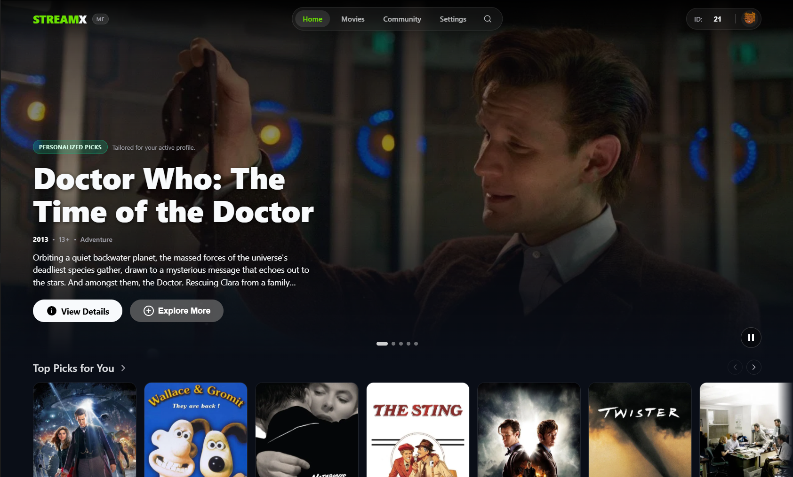
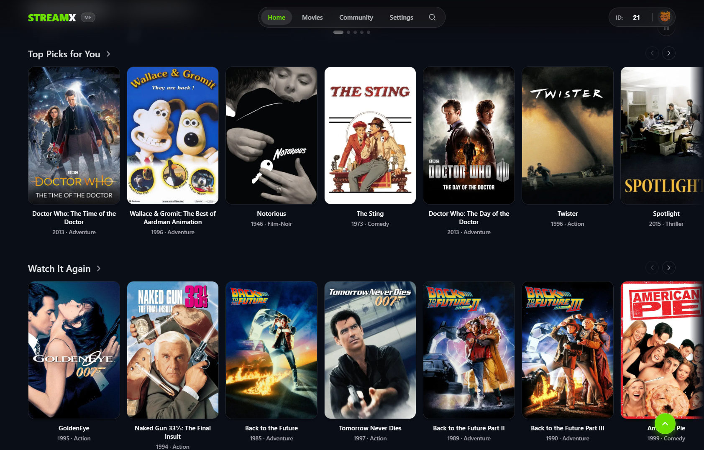
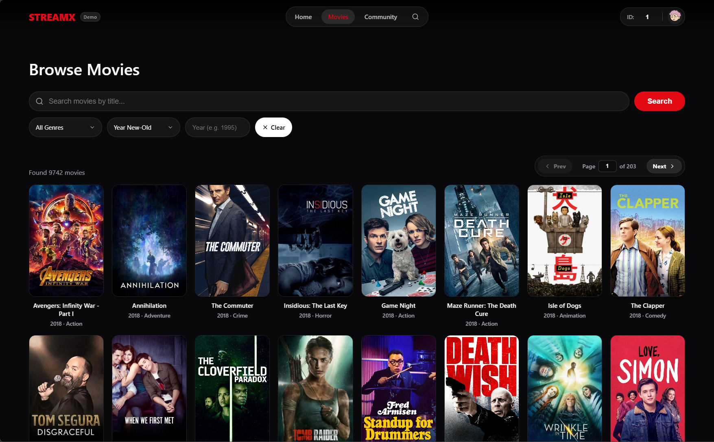
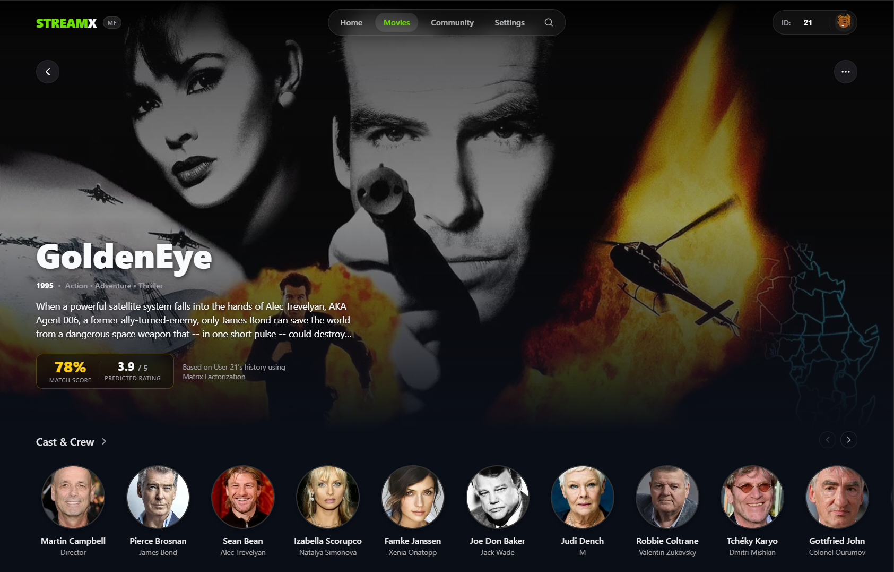
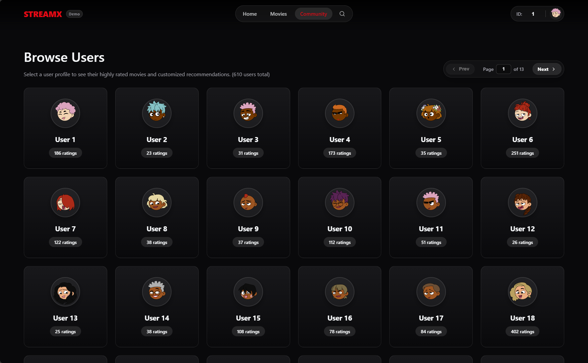
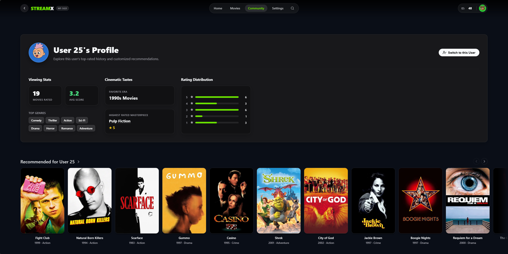
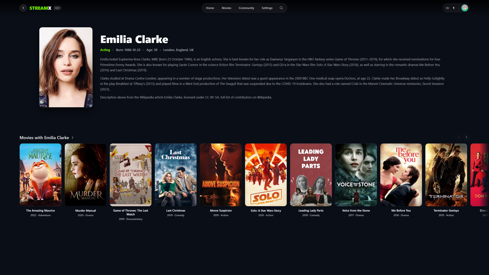
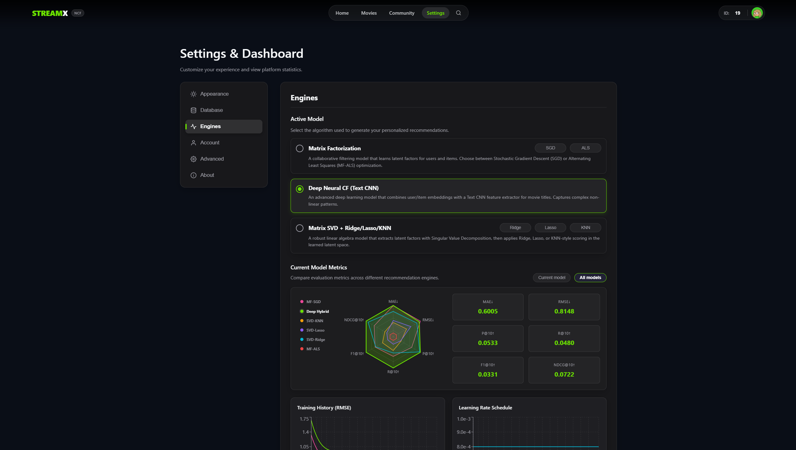

<h2 align="center">
  StreamX - Movies Recommender System <br/>
</h2>

<p align="center">
  A full-stack application implementing a custom Recommender System with a modern web interface.
</p>

<p align="center">
  
  
  
  
  
</p>

## Report & Slides

- **Report (PDF):** [FinalReport/report.pdf](FinalReport/report.pdf)
- **Slides (PDF):** [FinalReport/slide/Comparative Study of Collaborative Filtering Methods for Movie Recommendation.pdf](FinalReport/slide/Comparative%20Study%20of%20Collaborative%20Filtering%20Methods%20for%20Movie%20Recommendation.pdf)

## Features

- **Robust Recommendation Engine**
  - **Matrix Factorization**: PyTorch mini-batch SGD (CUDA/MPS if available) and ALS on sparse CSR data with Numba-accelerated ALS steps. Early stopping on a validation split; suitable for 27M+ ratings.
  - **Deep Neural CF**: Hybrid deep learning model with Text CNN for title feature extraction.
  - **Matrix SVD**: Closed-form SVD latent factors calibrated with Ridge/Lasso/KNN regression.
- **Automated Data Processing**
  - Per-user random 80/20 data split for reliable training and testing.
- **Comprehensive Evaluation Metrics**
  - **Rating Prediction**: `MAE`, `RMSE`
  - **Top-K Recommendations**: `Precision@10`, `Recall@10`, `F-measure@10`, `NDCG@10`
- **Structural Data Analysis**
  - Distribution profiling, feature influence analysis, latent factor interpretation, and synthetic data generation.
- **Modern Web Interface (Next.js + Django)**
  - Browse library with multi-genre filtering and sorting.
  - Detailed movie pages with metadata and similar movie suggestions.
  - Personalized user profiles showcasing rating history and top recommendations.
  - Dynamic TMDB API integration for rich image enrichment (posters and backdrops).

## UX Preview

| Home Page | Top Picks |
| :---: | :---: |
|  |  |

| Library | Movie Detail | Community |
| :---: | :---: | :---: |
|  |  |  |

| User Profile | Actor Detail | Settings |
| :---: | :---: | :---: |
|  |  |  |

## Project Structure

```text
dataset/          # Raw MovieLens data (e.g. ml-latest/)
backend/          # Django REST API
frontend/         # Next.js web application
models/           # ML model code and generated artifacts (option1, option2, option3_ridge, option3_lasso, option4, splits)
scripts/          # Training, evaluation, enrichment, and report generation
analysis/         # Final report (final_report.md), figures, and JSON/CSV artifacts
```

## Getting Started

### Quick start (after environment setup)

Once the Python venv and dependencies are installed (Step 1 below) and the model is trained (Step 2), you can start both backend and frontend with one command:

- **Windows (PowerShell):** `.\start.ps1`
- **macOS / Linux:** `./start.sh`

This starts the Django API on port 8001 and the Next.js app on port 3001, and opens the app in your browser.

### 1. Python Environment Setup

Requires **Python 3.11** (or a compatible 3.x version). Create and activate a virtual environment, then install dependencies:

```bash
# macOS / Linux
python -m venv .venv
source .venv/bin/activate

# Windows
python -m venv .venv
.venv\Scripts\activate

# Install dependencies
pip install -r requirements.txt
```

### 2. Train the Model

Train on MovieLens data under `dataset/ml-latest/` (or pass `--dataset-dir`).
Model files are written to `models/artifacts/<model-type>/`, and split metadata is shared in `models/artifacts/`.

Quick default run:

```bash
python -m scripts.train_and_evaluate --dataset-dir dataset/ml-latest --top-k 10
```

Model-specific quick runs:

```bash
python -m scripts.train_and_evaluate --model-type option1 --dataset-dir dataset/ml-latest
python -m scripts.train_and_evaluate --model-type option2 --dataset-dir dataset/ml-latest
python -m scripts.train_and_evaluate --model-type option3_ridge --dataset-dir dataset/ml-latest
python -m scripts.train_and_evaluate --model-type option3_lasso --dataset-dir dataset/ml-latest
python -m scripts.train_and_evaluate --model-type option3_KNN --dataset-dir dataset/ml-latest
python -m scripts.train_and_evaluate --model-type option4 --dataset-dir dataset/ml-latest
```

Detailed parameter presets and copy-ready commands are documented in [@TRAINING_PARAMETERS.md](docs/TRAINING_PARAMETERS.md).

> **GPU note:** Option 2 is PyTorch-based and auto-selects `cuda`/`mps` when available.
> Training, deep-model dependencies, and plotting tools are all included in:
> ```bash
> pip install -r requirements.txt
> ```

The script caches a shared train/test split in `models/artifacts/splits/` so all models are evaluated on the same holdout split.
Use `--force-resplit` to regenerate.

### 3. Fetch Movie Information (Optional but Recommended)

Enrich movie records with posters, backdrops, overviews, and cast/director data from [TMDB](https://www.themoviedb.org/documentation/api). The script reads `movies.csv` from `dataset/ml-latest` (or `--dataset-dir`) and writes `movies_enriched.csv` beside it. If the dataset copy is unavailable, it falls back to `models/artifacts`. Run **after** training (Step 2).

1. Get a free API key at [TMDB](https://www.themoviedb.org/documentation/api) and create a `.env` in the project root:
   ```bash
   TMDB_API_KEY=your_api_key_here
   ```
2. Run the scraper:
   ```bash
   python -m scripts.scrape_tmdb
   ```

### 4. Start the Backend API

Start the Django development server:

```bash
cd backend
python manage.py runserver 8001
```

> **⚡ Performance Architecture — Lazy Loading:**
> The backend uses a **lazy model loading** strategy optimized for the full MovieLens 27M dataset. On startup, the server only scans which model files exist on disk (instant) rather than loading all 5 model pickle files into memory (which would take 30+ seconds).
>
> - **First request after startup:** The active model (~100–200 MB) is loaded on-demand when the first API request arrives. Expect a **~15–25 second** wait on the very first request (or when switching to a new model via Settings).
> - **All subsequent requests:** Served from memory in **< 5 ms**. Models stay cached until the server restarts.
> - **Switching models:** When you switch the active model in the frontend Settings page, the newly selected model is loaded on-demand. This takes ~15–25 seconds for the first request with that model, then all subsequent requests are instant.
>
> User history and rating statistics are computed dynamically via Pandas DataFrames rather than pre-built Python dictionaries, reducing memory usage from ~5 GB to ~500 MB for the full dataset.

**Warnings you can safely ignore** (they do not affect functionality):
```
Pandas requires version '2.10.2' or newer of 'numexpr' ...
nopython is set for njit and is ignored ...
You have 2 unapplied migration(s) ...
```

**Key Endpoints:**
- `GET /api/health` — API health check
- `GET /api/movies` — Paginated movies with search and genre filters
- `GET /api/movie/<id>` — Movie detail and metadata
- `GET /api/recommend/<user_id>` — Top-K recommendations for a user
- `GET /api/users` — User list
- `GET /api/user/<user_id>/history` — User rating history
- `GET /api/predict/<user_id>/<item_id>` — Predicted rating for a user–item pair
- `GET /api/search` — Full-text movie search
- `GET /api/stats` — Database statistics
- `GET /api/model-config` — Loaded model configuration
- TMDB and scrape endpoints for image enrichment (see backend `api/urls.py` for full list)

### 5. Start the Frontend Application

In a new terminal, start the Next.js application:

```bash
cd frontend
npm install
npm run dev -- -p 3001
```

*(Optional)* If you need to specify a custom backend URL:
```bash
NEXT_PUBLIC_API_BASE_URL="http://localhost:8001/api" npm run dev -- -p 3001
```

**Access the application at:** `http://localhost:3001`

## Deploy on Render

This repository includes a `render.yaml` blueprint for a two-service deployment:

- `streamx-backend` (Django API, Python)
- `streamx-frontend` (Next.js UI, Node.js)

### 1) Connect the repository

In Render, create a **Blueprint** service and point it to this repository. Render will detect `render.yaml` and propose both services.

### 2) Configure frontend API URL

Set frontend env var `NEXT_PUBLIC_API_BASE_URL` to your backend public URL:

```text
https://<your-backend-service>.onrender.com/api
```

### 3) Model/data storage on Render

For the free-tier blueprint, the backend uses `STREAMX_DATA_DIR=/tmp/streamx`.

- On first boot, `backend/start_render.sh` seeds that directory from `models/artifacts/`.
- Runtime updates (for example `active_model.txt`, `movies_enriched.csv`, and `scrape_state.json`) are written there while the instance is alive.
- Note: `/tmp` is ephemeral on free tier, so data may reset after restart/redeploy.

### 4) Required backend environment variables

- `SECRET_KEY` (generated in blueprint by default)
- `DEBUG=False`
- `ALLOWED_HOSTS=.onrender.com` (or your custom domain list)
- `TMDB_API_KEY` (optional, required for TMDB scraping endpoints)

## Technical Notes

- The data loader supports both `csv` and `dat` MovieLens formats.
- The recommender algorithm is built from scratch and does not rely on black-box recommendation libraries.
- The analysis pipeline is designed to support course-style interpretation questions, not only predictive metrics.
- The UI features a responsive design, glass-morphism effects, and dynamic filtering components.


## Acknowledgements

Special thanks to the open-source projects and communities that made this possible:
- **[MovieLens](https://grouplens.org/datasets/movielens/)** for the core datasets used in model training and evaluation.
- **[TMDB API](https://www.themoviedb.org/documentation/api)** for providing rich movie metadata and high-quality image assets.
- **[Next.js](https://nextjs.org/)** & **[Django](https://www.djangoproject.com/)** for powering the frontend and backend architectures respectively.
- **[pandas](https://pandas.pydata.org/)** & **[NumPy](https://numpy.org/)** for efficient data manipulation and computation.