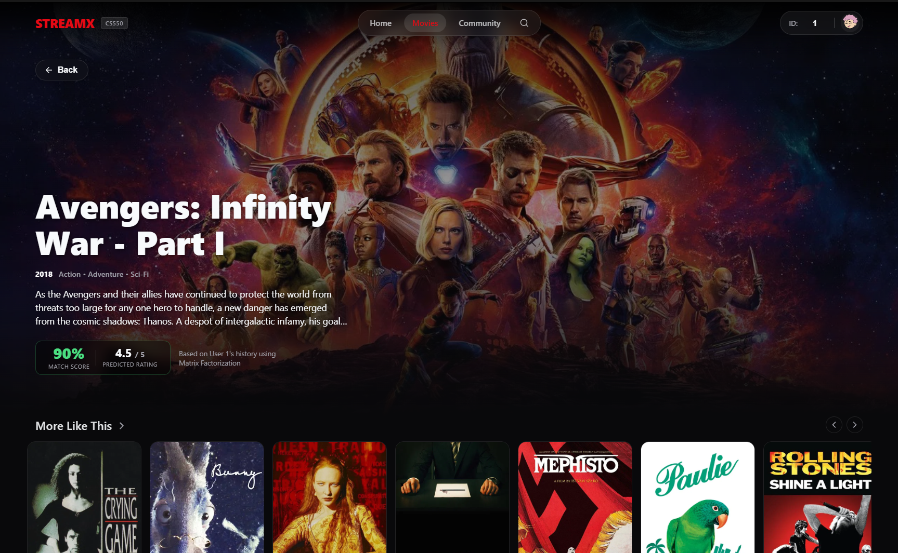

# Movies Recommender System

A full-stack application implementing a custom Recommender System with a modern web interface.

## Features

- **Robust Recommendation Engine**: Custom Matrix Factorization model trained with Stochastic Gradient Descent (SGD).
- **Data Processing**: Automated per-user random 80/20 data split for training and testing.
- **Evaluation Metrics**:
  - Rating prediction: **MAE**, **RMSE**
  - Top-K recommendations: **Precision@10**, **Recall@10**, **F-measure@10**, **NDCG@10**
- **Modern Web Interface**: Built with Next.js and Django, featuring:
  - Browse library with multi-genre filtering and sorting
  - Detailed movie pages with metadata and similar movie suggestions
  - Personalized user profiles showcasing rating history and top recommendations
  - Dynamic TMDB image enrichment for movie posters and backdrops

## UX Preview

| Home Page | Library |
| :---: | :---: |
|  |  |

| Movie Detail | Community | User Profile |
| :---: | :---: | :---: |
|  |  |  |

## Project Structure

```text
dataset/          # Raw datasets (MovieLens format supported)
backend/          # Django REST API
frontend/         # Next.js web application
models/           # ML model architecture and generated artifacts
scripts/          # Training, evaluation, and data enrichment scripts
```

## Getting Started

### 1. Python Environment Setup

Create and activate a virtual environment, then install dependencies:

```bash
# macOS / Linux
python -m venv .venv
source .venv/bin/activate

# Windows
python -m venv .venv
.venv\Scripts\activate

# Install dependencies
pip install -r requirements.txt
```

### 2. Train the Model

Train the recommender model using the provided dataset. Artifacts (model, split data, metrics) will be saved to `models/artifacts/`.

```bash
python -m scripts.train_and_evaluate --dataset-dir frontend/ml-latest-small/ml-latest-small --top-k 10
```

*(Optional)* Tune Matrix Factorization hyperparameters:
```bash
python -m scripts.train_and_evaluate --dataset-dir frontend/ml-latest-small/ml-latest-small --n-factors 48 --epochs 30 --lr 0.01 --reg 0.05
```

### 3. Fetch Movie Images (Optional but Recommended)

To display high-quality posters and backdrops, run the TMDB enrichment script. This will generate `movies_enriched.csv`.

> **Note**: Before running the script, you must obtain a free API key from [TMDB](https://www.themoviedb.org/documentation/api) and manually add it to `scripts/scrape_tmdb.py` (update the `API_KEY` variable).

```bash
python -m scripts.scrape_tmdb
```

### 4. Start the Backend API

Start the Django development server:

```bash
cd backend
python manage.py runserver 8001
```

**Key Endpoints:**
- `GET /api/health`
- `GET /api/movies` (Supports pagination, search, and genre filtering)
- `GET /api/movie/{id}`
- `GET /api/recommend/{user_id}`

### 5. Start the Frontend Application

In a new terminal, start the Next.js application:

```bash
cd frontend
npm install
npm run dev -- -p 3001
```

*(Optional)* If you need to specify a custom backend URL:
```bash
NEXT_PUBLIC_API_BASE_URL="http://localhost:8001/api" npm run dev -- -p 3001
```

**Access the application at:** `http://localhost:3001`

## Technical Notes

- The data loader supports both `csv` and `dat` MovieLens formats.
- The recommender algorithm is built from scratch and does not rely on black-box recommendation libraries.
- The UI features a responsive design, glass-morphism effects, and dynamic filtering components.

## Acknowledgements

Special thanks to the open-source projects and communities that made this possible:
- **[MovieLens](https://grouplens.org/datasets/movielens/)** for the core datasets used in model training and evaluation.
- **[TMDB API](https://www.themoviedb.org/documentation/api)** for providing rich movie metadata and high-quality image assets.
- **[Next.js](https://nextjs.org/)** & **[Django](https://www.djangoproject.com/)** for powering the frontend and backend architectures respectively.
- **[pandas](https://pandas.pydata.org/)** & **[NumPy](https://numpy.org/)** for efficient data manipulation and computation.