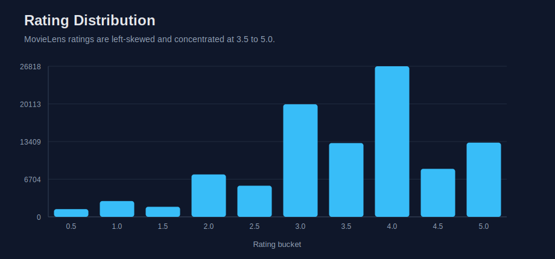
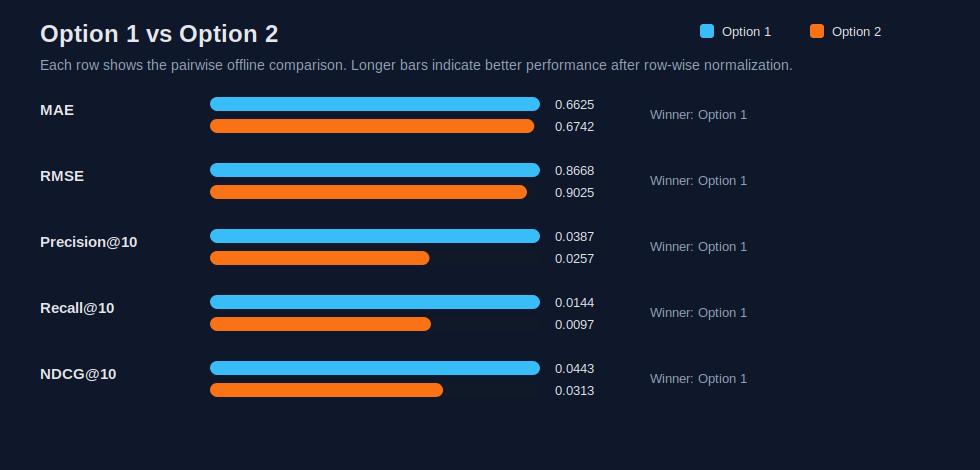
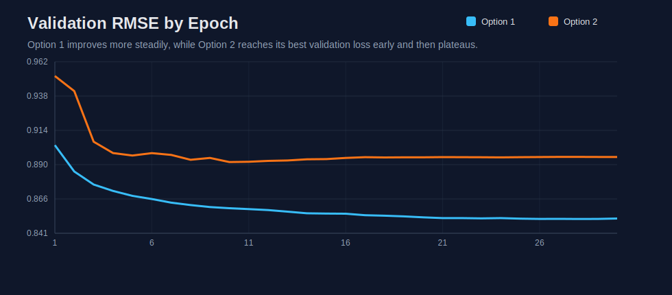
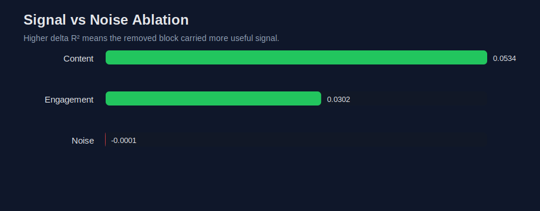
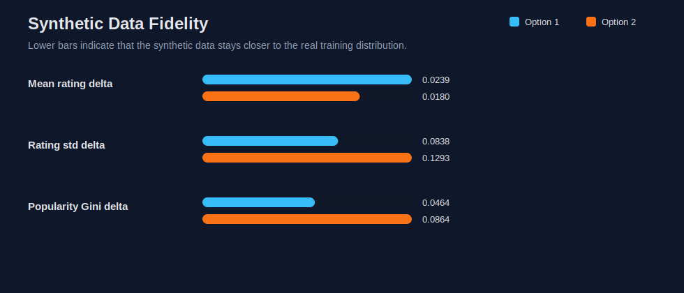

# MovieLens Recommender Systems

_This report evaluates two recommendation strategies on the MovieLens small dataset, assessing predictive performance, ranking quality, and structural fidelity._

## Problem Framing

This project analyzes the MovieLens small dataset as a structured user-item system rather than treating it solely as a prediction benchmark. The objective is to understand the underlying data distribution, identify significant observed features, separate signal from noise, interpret latent factors, and test whether the learned structure is rich enough to generate realistic synthetic interactions.

## Executive Summary
- **Performance Dominance**: `Option 1` (Matrix Factorization) is the strongest overall offline model. It improves RMSE by 4.0% and NDCG@10 by 41.6% over `Option 2` (Hybrid Deep Recommender).
- **Data Structural Forces**: The dataset is highly sparse (0.983) and strongly long-tailed, making item popularity and user activity major structural drivers.
- **Feature Influence**: The strongest observed rating driver is `Log Item Popularity` (coefficient 0.1470, 95% CI strictly positive).
- **Synthetic Fidelity**: `Option 1` preserves the long-tail item-popularity shape better than `Option 2` (Gini delta 0.046 vs 0.086).

## Dataset And Experimental Setup
- Dataset size: 610 users, 9724 movies, 100836 ratings, and tags for 16.1% of movies.
- Data coverage: density = 0.0170, sparsity = 0.9830.
- Split policy: a shared per-user 80/20 holdout split is reused across Option 1 and Option 2 so that model comparison is fair.
- `Option 1`: matrix factorization with explicit SGD updates and learned user/item biases.
- `Option 2`: hybrid deep recommender that combines user embeddings with item ID, title, and genre features.
- Confidence strategy: held-out evaluation, bootstrap confidence intervals for feature coefficients, and explicit block ablations for signal-vs-noise checks.

### Strategy Definitions
**`Option 1` (Pure Collaborative Filtering)**: This strategy factorizes the user-item rating matrix into low-dimensional user and movie embeddings, predicting a rating from those latent factors plus learned user and item bias terms. It learns exclusively from interaction history: if two users rated similar movies similarly in the past, the model uses that shared behavior to estimate future preferences.

**`Option 2` (Hybrid Content-Aware Recommender)**: This strategy learns user representations but constructs the item representation from multiple inputs: movie ID, title text, and genre features. It combines collaborative signals with item metadata, leveraging both *who* liked the movie and *what* the movie is.

The comparison is fundamentally between two recommendation paradigms: a simpler interaction-only collaborative model (`Option 1`) and a richer hybrid model that integrates content features (`Option 2`).

## Model Architecture
### Option 1: Biased Matrix Factorization
It learns one latent vector for each user $p_u \in \mathbb{R}^{48}$, one latent vector for each item $q_i \in \mathbb{R}^{48}$, one user bias $b_u$, one item bias $b_i$, and a global mean rating $\mu$.

Prediction formula:
$$
\hat{r}_{ui} = \text{clip}(\mu + b_u + b_i + p_u^T q_i, 0.5, 5.0)
$$

Regularized training objective:
$$
\mathcal{L}_{\text{Option1}} = \sum_{(u,i)} (r_{ui} - \mu - b_u - b_i - p_u^T q_i)^2 + \lambda (\|p_u\|_2^2 + \|q_i\|_2^2 + b_u^2 + b_i^2)
$$

### Option 2: Two-Tower Hybrid Neural Architecture
The user tower is a learned user-ID embedding with dropout. The item tower combines three signals: an item-ID embedding, a title-text branch, and a genre branch. The title branch uses token embeddings followed by 1D convolutions with kernel sizes 2, 3, and 4, global max pooling, and a dense projection. The genre branch uses genre embeddings followed by global average pooling. Those item-side features are concatenated, passed through dense layers, and projected into a 48-dimensional item vector.

Title and genre feature construction:
$$
t_i = \text{Dense}(\text{concat}(\text{MaxPool}(\text{Conv2}(E_{\text{title}}(T_i))), \text{MaxPool}(\text{Conv3}(E_{\text{title}}(T_i))), \text{MaxPool}(\text{Conv4}(E_{\text{title}}(T_i))))) \\
g_i = \text{AvgPool}(E_{\text{genre}}(G_i)) \\
v_i = \text{Dense}(\text{concat}(e_{\text{i\_id}}, t_i, g_i))
$$

Centered prediction formula:
$$
\hat{s}_{ui} = a_u^T v_i + b_u + b_i \\
\hat{r}_{ui} = \text{clip}(\mu + \hat{s}_{ui}, 0.5, 5.0)
$$

**Interpretation**: `Option 1` learns structure strictly from historical interactions, whereas `Option 2` explicitly injects external metadata constraints through title and genre encoders.

## Training Strategy
Both models are evaluated on a shared per-user 80/20 holdout split to ensure all reported differences stem from the model architecture rather than data partitioning.

### Option 1 Training
- **Optimization**: Trained for up to 30 epochs using explicit Stochastic Gradient Descent (SGD).
- **Hyperparameters**: Latent dimension of 48, initial learning rate of 0.01, L2 regularization of 0.05, and a multiplicative learning-rate decay of 0.98 after each epoch.
- **Regularization & Stopping**: Utilizes a 10% validation slice from the training data to monitor validation RMSE. Employs early stopping with a patience of 3 epochs, restoring the best validation checkpoint to prevent overfitting.

### Option 2 Training
- **Optimization**: Trained for up to 30 epochs using the Adam optimizer with gradient clipping (`clipnorm = 1.0`).
- **Hyperparameters**: Embedding dimension of 48, batch size of 256, initial learning rate of 0.001, dropout rate of 0.15, and L2 regularization of `1e-6`.
- **Loss Function**: Predicts a centered target $y_{ui} = r_{ui} - \mu$ and optimizes the Huber loss instead of standard Mean Squared Error (MSE), rendering the model less sensitive to large residual outliers.
- **Sample Weighting**: Upweights higher ratings during training to prioritize relevant items, using the formula $w_{ui} = 1 + \text{rating\_scaled}_{ui}^{1.25}$, where $\text{rating\_scaled}_{ui} = \text{clip}((r_{ui} - r_{\text{min}}) / (r_{\text{max}} - r_{\text{min}}), 0, 1)$.
- **Learning Rate Scheduling**: Uses a 10% validation slice to monitor validation loss. Applies `ReduceLROnPlateau` with a patience of 2 epochs, a reduction factor of 0.5, and a minimum learning rate of `1e-5`, restoring the best validation checkpoint upon completion.

## Evaluation Criteria And Decision Rules
The report compares the two strategies on both rating prediction and recommendation ranking quality.

Rating-prediction criteria:
$$
\text{MAE} = \frac{1}{N} \sum |r_{ui} - \hat{r}_{ui}| \\
\text{RMSE} = \sqrt{\frac{1}{N} \sum (r_{ui} - \hat{r}_{ui})^2}
$$

Top-K recommendation criteria for each user $u$:
$$
\text{Precision@K} = \frac{|\text{Rec}_u(K) \cap \text{Rel}_u|}{K} \\
\text{Recall@K} = \frac{|\text{Rec}_u(K) \cap \text{Rel}_u|}{|\text{Rel}_u|} \\
\text{F1@K} = \frac{2 \times \text{Precision@K} \times \text{Recall@K}}{\text{Precision@K} + \text{Recall@K}}
$$

Ranking-quality criterion:
$$
\text{DCG@K} = \sum_{j=1}^{K} \frac{\text{rel}_j}{\log_2(j + 1)} \\
\text{NDCG@K} = \frac{\text{DCG@K}}{\text{IDCG@K}}
$$

In this project, $K = 10$ and $\text{Rel}_u$ is defined as all items in the held-out test set for user $u$ (`topn_relevance = all_test`). Lower MAE and RMSE are better, while higher Precision@10, Recall@10, F1@10, and NDCG@10 are better.

Additional structural-fidelity criteria:
$$
\text{mean\_delta} = |\text{mean}(r_{\text{real}}) - \text{mean}(r_{\text{syn}})| \\
\text{gini\_delta} = |\text{Gini}(\text{popularity}_{\text{real}}) - \text{Gini}(\text{popularity}_{\text{syn}})|
$$

The final judgment in this report is based primarily on two questions: (1) which model predicts ratings more accurately, and (2) which model ranks held-out items better. Training stability and synthetic-data fidelity serve as secondary decision criteria, where lower structural deltas indicate better preservation of the true data distribution.

## Figure 1. Rating Distribution

The ratings are centered at 3.50 with a standard deviation of 1.04 and a mild negative skew, indicating more positive than negative feedback. User activity and item popularity are strongly long-tailed: user-activity Gini is 0.604 and item-popularity Gini is 0.716. Consequently, any recommender trained on this dataset must learn under conditions of severe sparsity and popularity imbalance.

## Model Comparison

| Metric | Option 1 | Option 2 |
| --- | ---: | ---: |
| MAE | 0.6625 | 0.6742 |
| RMSE | 0.8668 | 0.9025 |
| Precision@10 | 0.0387 | 0.0257 |
| Recall@10 | 0.0144 | 0.0097 |
| NDCG@10 | 0.0443 | 0.0313 |

`Option 1` outperforms `Option 2` across every reported offline metric. In strategic terms, the interaction-only collaborative model generalizes better on this dataset than the hybrid content-aware model. A likely reason is that while MovieLens small is informative, it lacks sufficient data volume to effectively train a higher-capacity architecture that mixes ID embeddings with complex text and categorical towers without overfitting.

## Figure 2. Validation RMSE During Training

The training curves reinforce the quantitative comparison. `Option 1` improves gradually across most of the training run, whereas `Option 2` reaches its best validation loss early and subsequently plateaus. This pattern is characteristic of a model that memorizes the training set quickly but fails to extract additional generalizable structure from the supplementary content features.

## Feature Influence And Interpretability
The feature analysis is intentionally model-agnostic. It employs the shared train/test split and an interpretable linear regression to identify which observed covariates are statistically associated with ratings.

- `Log Item Popularity`: coefficient = 0.1470, 95% CI [0.1233, 0.1653]
- `Log User Activity`: coefficient = -0.1112, 95% CI [-0.1275, -0.0985]
- `Log Tag Count`: coefficient = 0.0999, 95% CI [-0.1294, 0.3474]
- `Genre: Animation`: coefficient = 0.0970, 95% CI [0.0775, 0.1121]
- `Genre: Children`: coefficient = -0.0938, 95% CI [-0.1091, -0.0754]
- `Genre: Drama`: coefficient = 0.0922, 95% CI [0.0792, 0.1077]

The strongest positive association derives from item popularity, while higher user activity exhibits a negative coefficient. This suggests that heavy users are either harder to satisfy on average or spread their attention across more niche, lower-rated tastes. Several content signals are also statistically significant: animation and drama show positive associations, while children's genres and newer release years trend negative after controlling for other variables.

## Figure 3. Signal Versus Noise Ablation

The full linear feature model achieves a test $R^2 = 0.1116$. Ablating the content block reduces $R^2$ by 0.0534, which is larger than the engagement-block drop of 0.0302. In contrast, removing the injected random noise features has effectively zero impact. This directly addresses the signal-vs-noise question: both content and engagement provide valid signal, but the content block carries the strongest marginal predictive power in this observational setup.

## Latent Structure
- `Option 1` latent dimension: 48. Its first component explains only 0.034 of latent variance, which suggests a relatively distributed representation.
- `Option 2` latent dimension: 48. Its first component explains 0.472 of latent variance, indicating a more concentrated leading axis.
- `Option 1` component 1 is positively associated with Action (0.058), Comedy (0.052), Romance (0.033) and negatively associated with Drama (-0.073), War (-0.041), Crime (-0.038).
- `Option 2` component 1 is positively associated with Action (0.159), Horror (0.139), Comedy (0.117) and negatively associated with Drama (-0.260), Documentary (-0.147), War (-0.093).

These latent factors elucidate the learned recommendation space. In `Option 1`, the latent geometry is distributed across multiple weak preference axes. In `Option 2`, the first latent principal component dominates heavily, reflecting a sharp separation between mainstream genre-heavy items and niche dramatic or documentary titles. While such concentration might be advantageous on a massive dataset, here it correlates with weaker offline generalization.

## Synthetic Data Check

Both models can generate synthetic ratings with the same number of interactions as the real training set. `Option 1` produces a mean-rating delta of 0.0239 and an item-popularity Gini delta of 0.0464. `Option 2` produces a mean-rating delta of 0.0180 and an item-popularity Gini delta of 0.0864. The better synthetic-fidelity model on this test is Option 1.

While this does not prove that the model has fully captured the true data-generating process, it serves as a rigorous structural sanity check. The synthetic samples preserve rating moments and user-activity distributions closely. Notably, `Option 1` preserves the item-popularity long tail significantly more faithfully than `Option 2`.

## **Justification**
- Both recommender options are evaluated on the same cached holdout split.
- Feature-level claims are rigorously supported by bootstrap confidence intervals rather than point estimates alone.
- The analysis explicitly separates observed-feature associations from latent-factor interpretation, avoiding confounding the two.
- Signal-vs-noise is tested empirically via block ablation and injected random control features.
- Synthetic-data realism is evaluated with direct comparisons against real summary statistics.

## Limitations
- The feature-influence analysis is observational, not causal. The coefficients describe association, not intervention effects.
- Offline ranking metrics (e.g., NDCG) do not guarantee improved online user satisfaction or business impact.
- The dataset is small relative to modern production recommendation systems. Consequently, `Option 2` may be underpowered or over-parameterized in this specific context.
- The synthetic-data validation focuses on marginal statistics and long-tail distributions; it does not validate higher-order temporal dynamics or sequential dependencies.

## Conclusion
For this dataset and project scope, **`Option 1` (Matrix Factorization) is recommended as the primary model**. It demonstrates superior predictive accuracy, more stable training dynamics, and stronger synthetic-data structural fidelity. `Option 2` remains analytically valuable, illustrating the generalization challenges that arise when introducing architectural complexity (content towers) without sufficient data volume to support it.

## Artifact Traceability
- Raw comparison artifacts: `analysis/artifacts/final_summary.json`
- Per-model structural analysis: `analysis/artifacts/option1_analysis.json`, `analysis/artifacts/option2_analysis.json`
- Synthetic interaction samples: `analysis/artifacts/option1_synthetic_ratings.csv`, `analysis/artifacts/option2_synthetic_ratings.csv`
- Figures: `analysis/figures/`
